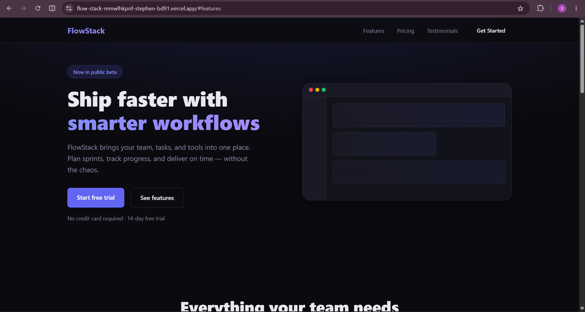

# FlowStack
A modern, responsive SaaS landing page and interactive pricing calculator built with plain **HTML, CSS, and JavaScript**.

## Image


## Live demo
[View The Live Demo](https://flow-stack-mmwlhkpnf-stephen-bd91.vercel.app/)

## Features
- Interactive pricing calculator with real-time sliders for team members, storage, and active projects
- Monthly / Yearly billing toggle with an instant 20% annual discount calculation
- Dynamic animated price output with visual breakdown of tier costs and savings
- Modern dark-mode UI with frosted-glass navigation (`backdrop-filter`), glowing gradient accents, and a floating dashboard mockup
- Fully responsive design: slide-out mobile drawer with animated hamburger toggle, 2-column tablet layouts, and full desktop grid
- Scroll-triggered reveal animations for feature and testimonial cards using the native `IntersectionObserver` API
- Accessible and semantic HTML5 markup (`<header>`, `<main>`, `<article>`, `<blockquote>`, `<nav>`, `aria-expanded`)
- Pure frontend with zero external dependencies, libraries, or build steps

## Tech stack
- HTML5
- CSS3 (custom properties, Grid, Flexbox, `clamp()`, keyframe animations, glassmorphism)
- Vanilla JavaScript (DOM manipulation, dynamic pricing calculations, scroll reveals — no libraries)
- Modern System UI font stack (`system-ui`, `-apple-system`, `BlinkMacSystemFont`, `Segoe UI`)

## Project structure
```
├── index.html      # Page structure, semantic markup, and content
├── styles.css      # Design tokens, layouts, animations, and responsive breakpoints
├── script.js       # Mobile navigation toggle, pricing logic, and scroll observer
├── Screenshot.png  # UI preview screenshot
└── README.md
```

## Pricing formula
The pricing calculator dynamically calculates estimated subscription costs using the following model:
- **Base plan**: $49/mo
- **Team members**: $8 per user/mo (range: 1 – 500)
- **Storage**: $2 per 10 GB/mo (range: 10 – 1,000 GB)
- **Active projects**: $2 per project/mo (range: 1 – 100)
- **Yearly discount**: 20% off total monthly cost (`total * 0.8`), showing annual billing savings

## How it works
1. **Interactive calculation**: Event listeners on range sliders and the billing toggle trigger `calculatePrice()` on every user interaction.
2. **Dynamic feedback**: The total price updates with a smooth CSS `.bump` keyframe animation for tactile visual feedback.
3. **Itemized breakdown**: The cost breakdown list updates in real time to reflect individual tier expenses and applied annual discounts.
4. **Mobile drawer**: The navigation hamburger toggles an off-canvas drawer with smooth CSS slide transitions and auto-closes when any nav link is tapped.
5. **Scroll reveals**: An `IntersectionObserver` watches feature and testimonial cards, fading and translating them into view as they enter the viewport.

## Next steps (beyond this project)
- Currency switcher (e.g. USD, EUR, GBP) with real-time exchange rates
- Pre-configured tier presets (e.g. Starter, Growth, Enterprise) to quickly populate slider values
- Interactive modal dialog for the "Start free trial" signup flow with client-side form validation
- Optional light / dark theme toggle with persisted user preference

## Design notes
Color palette and typography follow a sleek, dark-mode 2026 SaaS aesthetic:
| Token | Hex | Use |
|---|---|---|
| Background | `#0A0A0F` | Deep dark page background |
| Surface | `#12121A` | Card containers, dashboard mock, mobile menu |
| Surface 2 | `#1A1A26` | Slider tracks, elevated card backgrounds |
| Border | `#2A2A3A` | Card borders, dividers, subtle outlines |
| Primary Indigo | `#6366F1` | Primary buttons, active slider thumb & track accents |
| Light Indigo | `#818CF8` | Button hover states, badge borders, gradient start |
| Soft Violet | `#A78BFA` | Gradient text accents, yearly badge highlight |
| Text Neutral | `#E8E8F0` | High-contrast body & heading text |
| Muted Grey | `#8888A0` | Secondary descriptions, subheadings, labels |

## License
Free to use and adapt.

